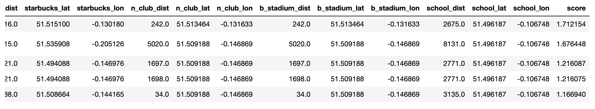

# Project-3

### Goals
The Goal for this project is to analyze startup database through mongoDB and python in order to find the best location for a new office via maps visualization graphics.

What I would like to present for this project is the best location in London city for the new offices taking as a starter point the offices that we have on the database 

### Querying and Cleansing

I started by querying the database with 3 mainly parameters and with this making 3 dataframe to find out the countries and cities with more companies.

The process ended with 3 cities with more companies.

-San Franciso
-New York
-London

Between this cities I chose London because its way closer to Spain and i feel will be less difficult set up the offices.

Taking London as the chosen place I query the database to take all the companies in London, with this result I made a Dataframe

Having all the companies and the office location, I request through Forsquare API what was the closest location of some establishments such as (Starbucks, School, Airport, Basketball Store, Night Club) for each companie office in London.

After having all this information in a dataframe I finally added one last column for Scores , score is a small formula to give each office a score on the distance to each establishment and the importance.

In possession of all this information I chose the top 5 locations.

### Analysis and Visualization

In order to see the 5 best locations for our offices I plotted the maps below. As we can see in the images below all the offices have a starbucks nearby,having a starbucks close had a high weight in the choice of the office (coffee is life).

#### First Office

#### Second Office

#### Third Office

#### Fourth Office

#### Fifth Office

### Conclusion

Giving high weight to the airport can be misleading because 90% are outside of the city , but the other places we want close can be found easy in the city center, also starbucks greatly reduce other possible locations, changing starbucks for any decent coffee bar can give better places.

